<p align="center">
  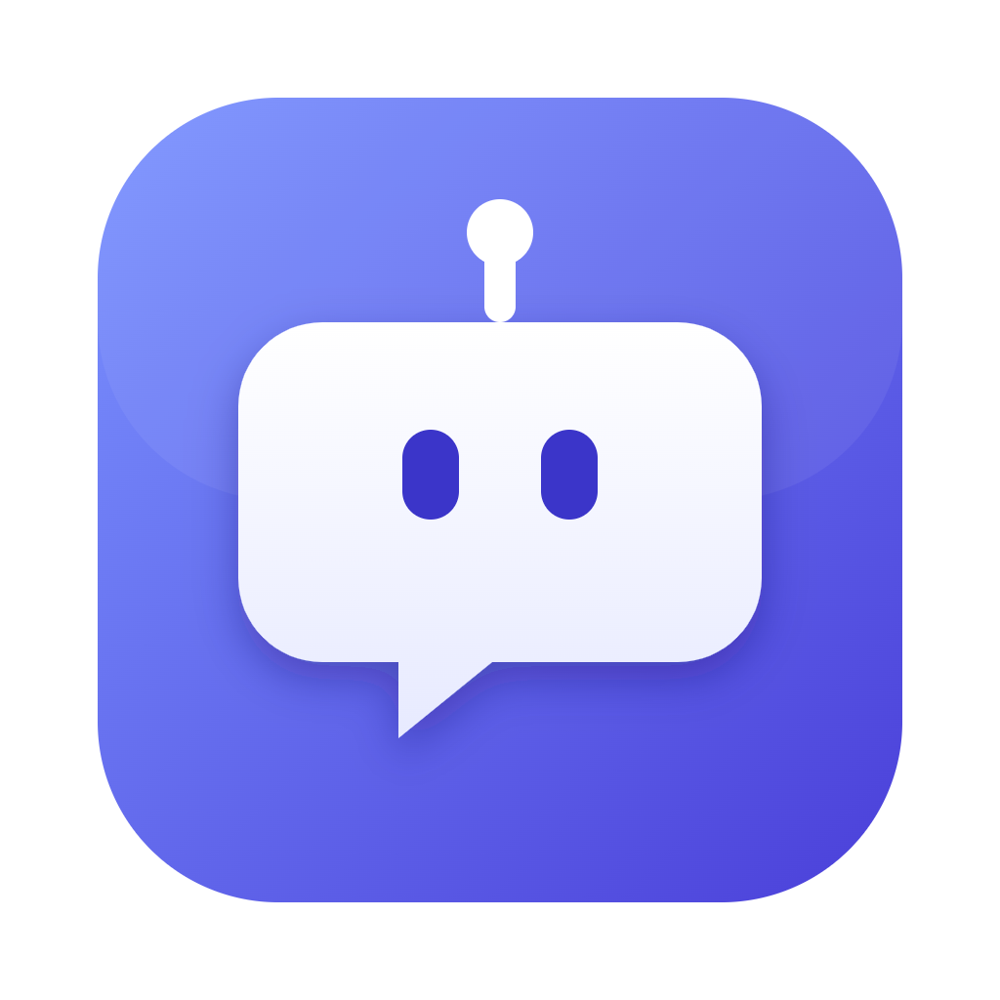
</p>

<h1 align="center">OpenBot</h1>

<p align="center">
  Your AI team, in one local-first desktop workspace.
  <br />Bring your own accounts. Keep control of your data, tools, and computer.
</p>

<p align="center">
  <a href="https://github.com/sanlega/OpenBot/actions/workflows/ci.yml"></a>
  
  
</p>

<p align="center">
  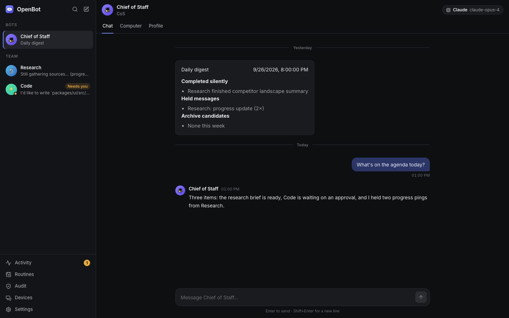
</p>

OpenBot is a desktop app for a small team of persistent AI **Bots**, in a chat that
feels like a team messenger. Each Bot runs on **Claude Code**, **Codex**, **Cursor**,
**OpenCode** (including local models from Ollama or LM Studio), **Gemini CLI**, **Grok
Build** or any other agent that speaks the Agent Client Protocol, with its own role,
model, permissions and tools. A **Chief of Staff** takes your requests,
does the work itself or hands it to the right Bot, and only comes back when there is
a result or it needs you.

Behind every quick call — which model answers, whether a new Bot is worth creating,
whether a message deserves a notification, whether a step is risky, what to click
next on a screen — sits **Jev**, a fast typed-decision API. Bots can also use a
**virtual computer**: a Linux desktop with a browser that you can watch live and
take over at any time.

Your keys and logins stay on your machine. OpenBot has no hosted backend and ships
no bundled credentials.

## What you can do

- **Build a small AI team.** Give each Bot a role, an engine and model, permissions,
  connected tools and, if it needs one, a computer. Each Bot has its own face, and its
  expression tells you whether it's thinking or waiting for you.
- **Delegate through the Chief of Staff.** It creates a new Bot only when an existing
  one can't do the job, hands tasks between Bots, and keeps progress chatter out of
  your way until there is something worth reading.
- **Approve what matters, skip what doesn't.** Reads and edits inside the shared
  workspace just happen. Anything with side effects outside it asks first, with
  **Allow once**, **Always allow** or **Deny**.
- **Let Bots use a browser.** With Docker Desktop, Bots drive Chromium on a shared
  Linux desktop, step by step, and you see every step in the chat.
- **Automate on a schedule.** Routines run a Bot's instructions every weekday at
  8:00 or on an event, and rehearse as dry runs until you turn on live runs.
- **Connect tools.** Add MCP servers from a curated gallery or the community
  registry, then choose which Bots may use each one.
- **Stay in the loop from your phone.** Pair a phone with a QR code on your Wi-Fi,
  Tailscale or Cloudflare Tunnel; traffic is end-to-end encrypted.

<table>
  <tr>
    <td width="50%">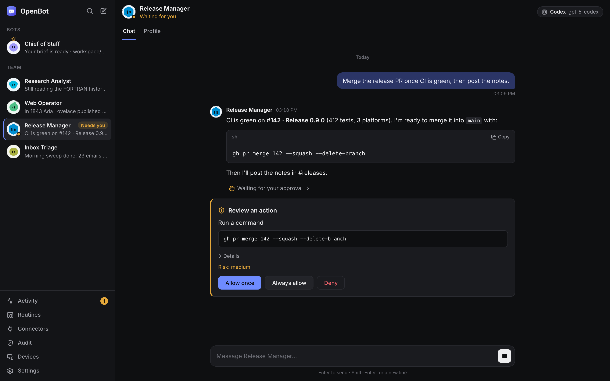</td>
    <td width="50%"></td>
  </tr>
  <tr>
    <td><b>Approvals</b> land in the chat, in plain words, with the exact command and a risk level.</td>
    <td><b>Activity</b> puts what's waiting on you first, then results, decisions and anything held back.</td>
  </tr>
  <tr>
    <td>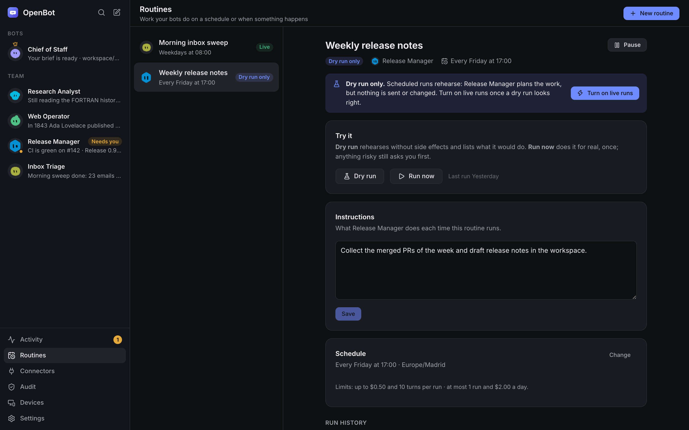</td>
    <td>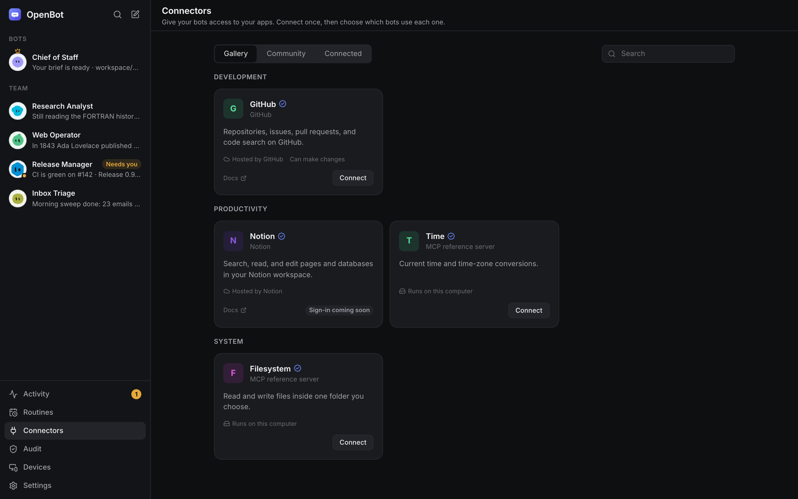</td>
  </tr>
  <tr>
    <td><b>Routines</b> start as dry runs: the Bot plans the work, nothing is sent until you turn on live runs.</td>
    <td><b>Connectors</b> are open MCP servers. Connect once, then choose which Bots use each one.</td>
  </tr>
</table>

## Jev: the fast decisions behind every Bot

[Jev](https://typesafe.ai) (by TypeSafe) answers **typed questions** — yes/no, one of
N, a score — in a few hundred milliseconds, and every answer comes with a calibrated
confidence. OpenBot never lets Jev write or run anything: it asks a question, reads
the answer, and applies it with its own code and safety checks.

| Where              | What Jev decides                                                                 |
| ------------------ | -------------------------------------------------------------------------------- |
| Every message      | Which engine and model answers (unless you pin one)                              |
| Chief of Staff     | Handle it, delegate it, or create a new Bot — and whether that Bot is justified  |
| Notifications      | Whether a Bot's message is worth interrupting you, or waits for the daily digest |
| Risky steps        | Whether an action is safe to take without asking you                             |
| Loops and routines | Whether a chain of Bots is going in circles; whether an event should start a run |
| Computer use       | Which action comes next on the screen, and whether the goal is already done      |

Confidence decides what happens next: **0.9 and above** OpenBot acts on its own,
**0.5–0.9** it asks for confirmation or takes the cautious path, below that it stops
and asks you. Without a Jev key nothing is guessed: Bots are only created when you ask,
risky steps always need your approval, and computer tasks stop with a clear reason.
Every decision is kept in the local `decisions` table, so you can see afterwards why
something happened.

<p align="center">
  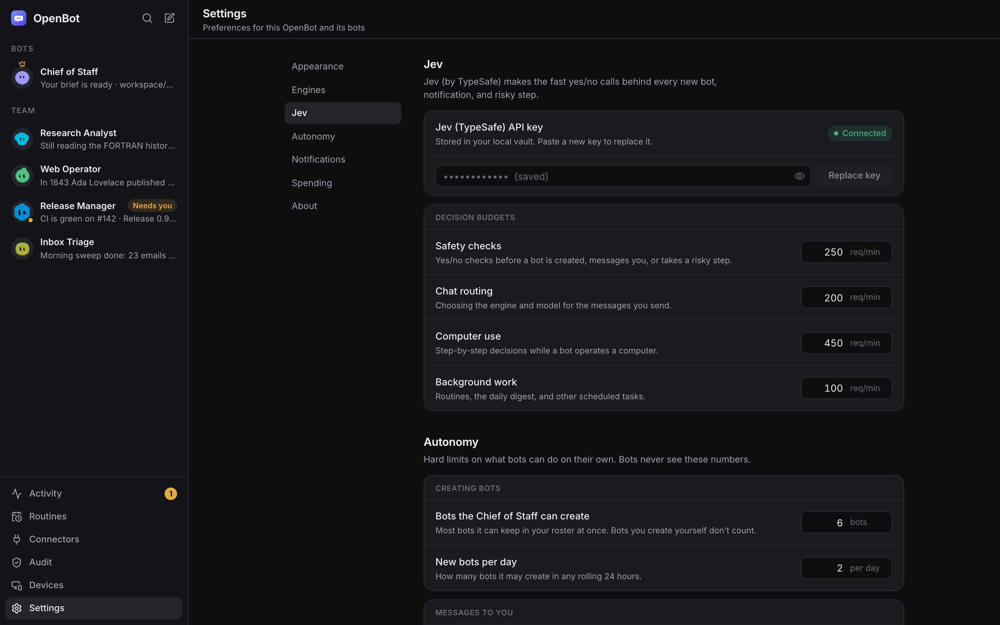
</p>

Add your TypeSafe key in the setup wizard or in **Settings → Jev**, where you can also
cap how many requests each kind of decision may make per minute.

## Computer use

With Docker Desktop running, OpenBot starts a Linux desktop in a container
(`images/desktop`: Xvfb, Chromium, and a noVNC live view). Each Bot with computer
access gets its own screen; the workspace folder is shared with the container. You can
watch any screen live and **take over** the mouse and keyboard at any time.

<p align="center">
  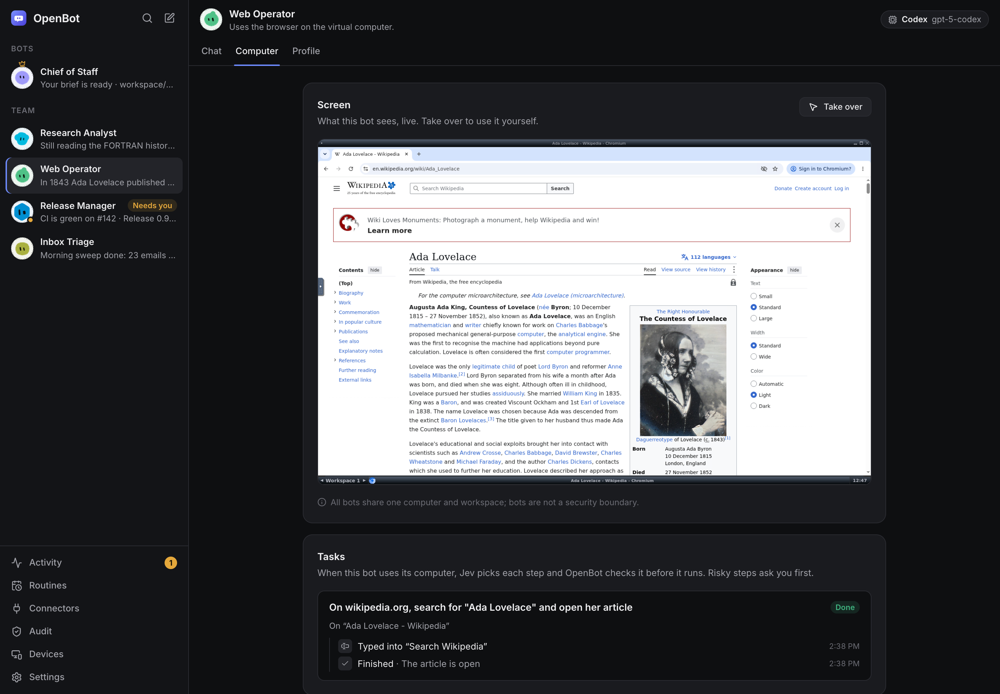
</p>

A Bot asks for a task in plain words (`computer_task`: _"On wikipedia.org, search for
'Ada Lovelace' and open her article"_). OpenBot then runs a fast loop in which Jev only
ever picks **one described action**:

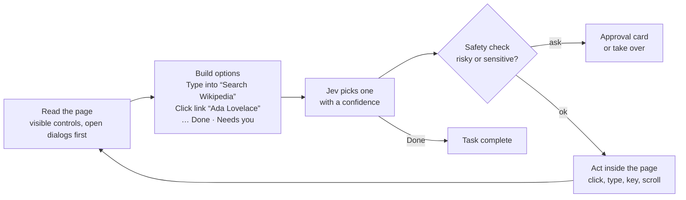

- **Options are described, not numbered.** Jev chooses between _"Type into searchbox
  'Search Wikipedia'"_ and _"Click link 'Ada Lovelace'"_, never between element #12
  and #40. Elements that mention the goal come first, and the list stays short.
- **Common chores are handled in code.** Cookie notices are closed ("Reject all"
  first) without asking Jev, and typing into a search box submits it.
- **Clicks and keys go inside the page** through the Chrome DevTools Protocol, so they
  land where they should wherever the window is.
- **Unsure means stop, not guess.** Below the confidence threshold the task stops and
  tells the Bot the likeliest options (_"click link 'Ada Lovelace' 34%, …"_), so it can
  steer the task, give it the text to type, or ask you. Logins, payments and 2FA hand
  the screen to you.
- **A stop is double-checked.** If a task stops short, Jev checks the final page
  against the goal once; if the goal is already met, the task counts as done.

In tests against live sites with a real Jev key, _"search Wikipedia for Ada Lovelace
and open her article"_ took 2 steps (about 2 seconds), and _"search YouTube for a
channel and open the first result"_ 3–4 steps (about 4 seconds).

<p align="center">
  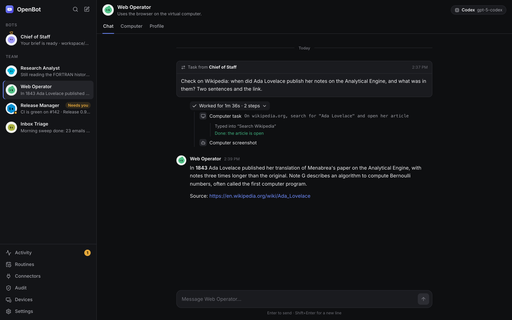
</p>

Every step shows up in the chat as it happens. Bots are not a security boundary from
each other — they share one workspace and one computer — and using **your own
machine** instead of the container is opt-in and asks every time.

## Get OpenBot

OpenBot is in active development. Download an installer from the
[latest GitHub Release](https://github.com/sanlega/OpenBot/releases/latest):
macOS DMGs are provided for Apple Silicon and Intel, Windows has an x64 installer,
and Linux has AppImage and `.deb` packages. Installers are not signed with a paid
developer certificate, so your operating system may show a security warning.

On macOS, drag OpenBot to Applications and open it once: macOS says it can't verify the
developer. Open **System Settings > Privacy & Security**, scroll to OpenBot and choose
**Open Anyway** (only the first time). If macOS says the app "is damaged" (0.1.15 and
earlier were not signed at all), run `xattr -dr com.apple.quarantine /Applications/OpenBot.app`
or install 0.1.16 or later.

Or build from source. You need Node.js **22.12 or newer** and pnpm **10**:

```sh
corepack enable
pnpm install
pnpm build
pnpm --filter @openbot/desktop start
```

On first launch, follow the setup wizard: add a TypeSafe (Jev) key and connect at
least one engine (their CLI login works; an API key is optional for Claude Code and
Codex). Docker Desktop is optional and enables the virtual computer. OpenBot keeps
credentials in a local encrypted vault.

### Engines

| Engine      | Install and sign in                                                          | Notes                                                                           |
| ----------- | ---------------------------------------------------------------------------- | ------------------------------------------------------------------------------- |
| Claude Code | `claude auth login`                                                          | Native driver                                                                   |
| Codex       | `codex login`                                                                | Native driver                                                                   |
| Cursor      | [Cursor CLI](https://cursor.com/cli), `cursor-agent login`                   | Your Cursor plan; runs from a private home, file writes fenced to the workspace |
| OpenCode    | [opencode.ai](https://opencode.ai), `opencode auth login` (optional)         | Cloud providers, free models, and **local models**                              |
| Gemini CLI  | [gemini-cli](https://github.com/google-gemini/gemini-cli), run `gemini` once | ACP mode                                                                        |
| Grok Build  | [x.ai/cli](https://x.ai/cli), `grok login`                                   | ACP mode                                                                        |
| Your own    | Settings > Engines > Your own ACP agents                                     | Any command that starts an ACP agent (Goose, Qwen Code, Copilot CLI...)         |

**Local models.** Install OpenCode and start Ollama or LM Studio: their models appear in a
Bot's model list (Settings > Engines shows what was found). OpenBot gives Ollama models a
32k context (it makes a copy of the model with a bigger `num_ctx`; the default 4096 tokens
cut the agent's instructions) and loads LM Studio models with the same context. Other
addresses: `OLLAMA_HOST`, `OPENBOT_LMSTUDIO_URL`; context size: `OPENBOT_LOCAL_CONTEXT`.
Small models (8-9B) handle short tool-using tasks; Jev routes heavier work elsewhere.
Engines are detected at start-up: restart OpenBot after installing or signing in to one.

<table>
  <tr>
    <td width="68%">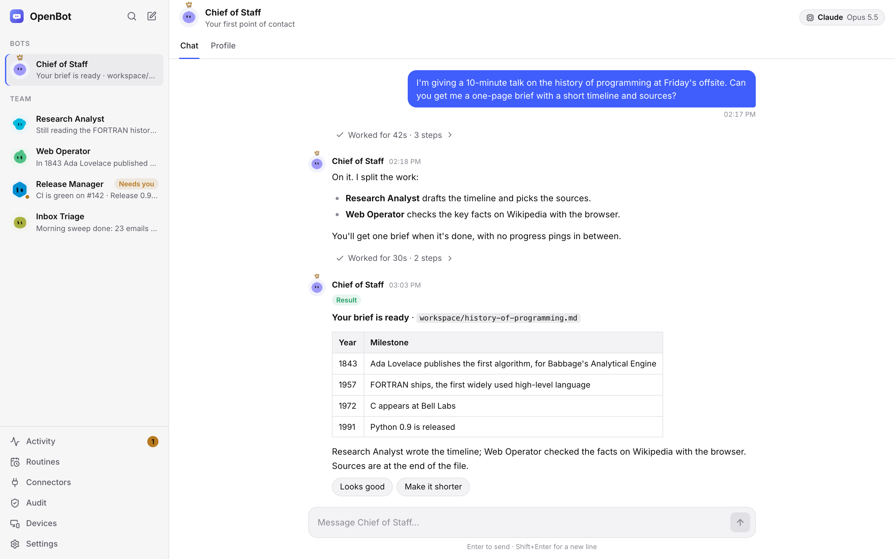</td>
    <td width="32%">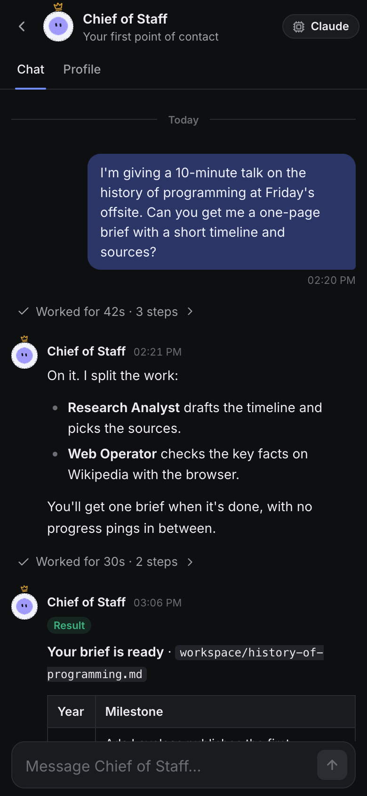</td>
  </tr>
  <tr>
    <td>Light and dark themes follow your system, or pick one in Settings.</td>
    <td>The same app on a paired phone.</td>
  </tr>
</table>

## Run the web UI

You can run the harness without the desktop shell and open its local UI in a browser:

```sh
pnpm --filter @openbot/server dev serve
```

Then visit [http://127.0.0.1:4577/app](http://127.0.0.1:4577/app).

## Develop and test

```sh
pnpm install
pnpm build
pnpm typecheck
pnpm test
pnpm lint
pnpm format:check
```

The monorepo uses TypeScript, Electron, React, Fastify, SQLite, and pnpm workspaces.
Unit and integration tests use fake engines, a fake computer and a fake Jev by
default, so routine development does not need provider credentials. Playwright covers
desktop and cross-package flows.

The screenshots in this README come from the UI's mock server with a demo scenario;
regenerate them after UI changes with `node scripts/readme-screenshots.mjs` (after
`pnpm build`).

For how it works inside (processes, a chat turn, safety gates, computer use,
storage, Client API), see [docs/architecture.md](docs/architecture.md). See
[CONTRIBUTING.md](CONTRIBUTING.md) for pull request guidance and the optional
AI-assisted workflow included with the repository.

## Project status

The desktop app, chat, team, approvals, routines, connectors and computer use work
end to end and are covered by automated tests; computer use has also been tested
against live sites with a real Jev key. OpenBot is still an early preview: real
provider and remote-access combinations continue to get manual testing. See the
[open issues](https://github.com/sanlega/OpenBot/issues) for current gaps.

## License

[MIT](LICENSE)
